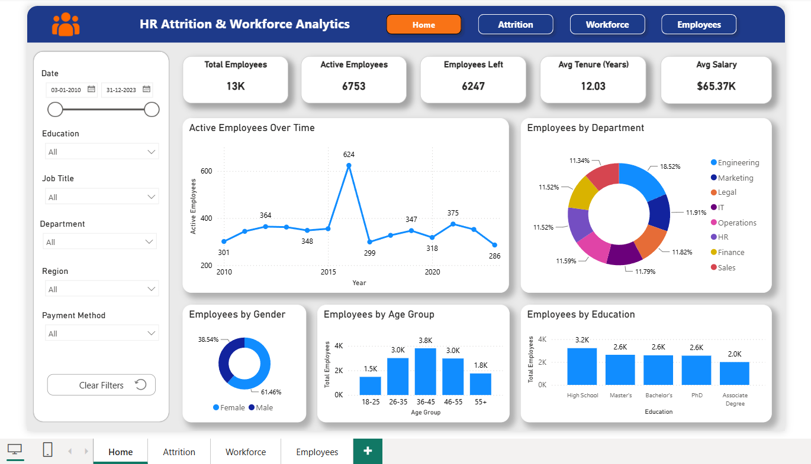
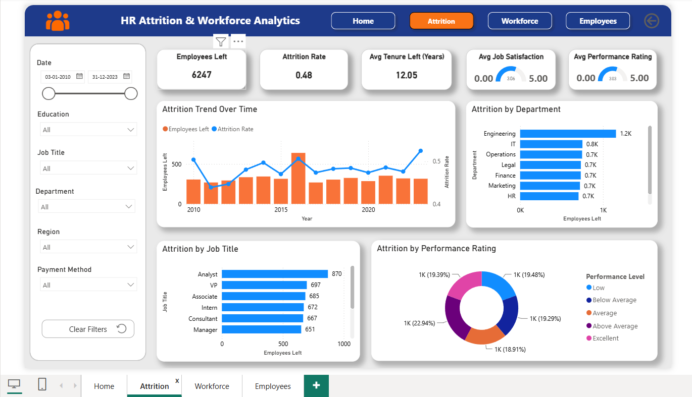
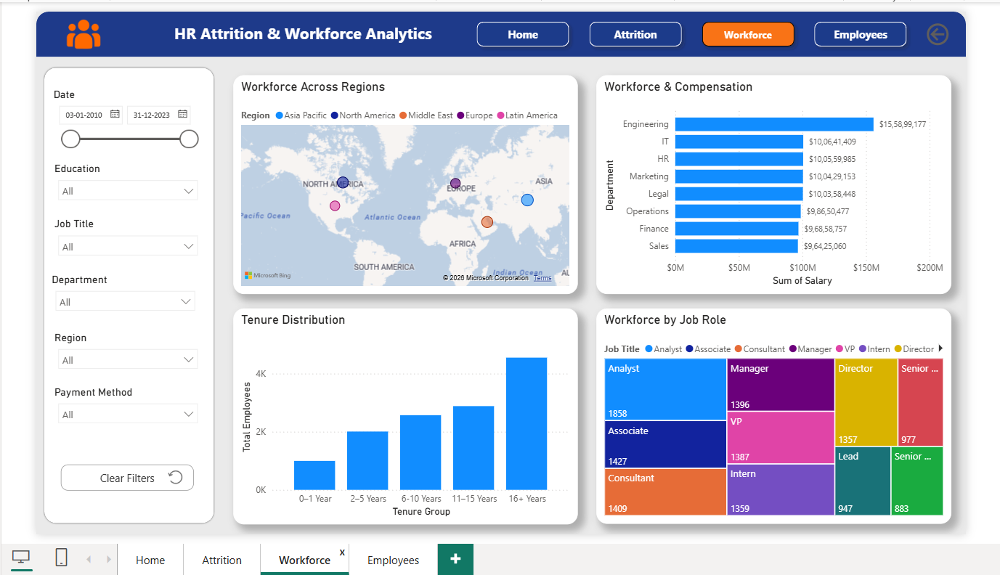
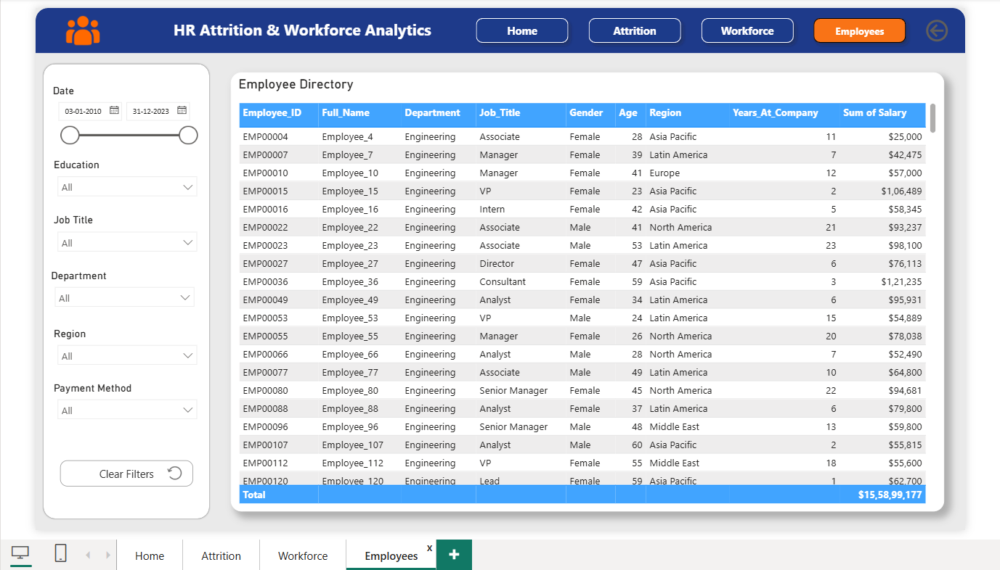

# 👥 HR Attrition & Workforce Analytics Dashboard

An interactive **Power BI HR analytics solution** designed to analyze employee attrition, workforce composition, compensation, tenure, employee demographics, and department-level trends.

The dashboard transforms employee-level HR data into actionable insights through an interactive multi-page reporting experience, helping HR teams understand **who is leaving, where attrition is concentrated, how the workforce is distributed, and how salary and tenure vary across the organization.**

---

## 📚 Data Source

The raw HR dataset used in this project was obtained from **Kaggle**.

**Dataset:** HR Attrition Messy Dataset
**Source:** [Kaggle – HR Attrition Messy Dataset](https://www.kaggle.com/datasets/priyanshu1yadav/hr-atttrition-messy-dataset?utm_source=chatgpt.com)

The original dataset was used as the raw data source and was subsequently **cleaned, transformed, structured, and modeled** for Power BI analysis.

The data preparation process included:

* Data cleaning and standardization
* Handling data quality issues
* Removing inconsistencies and preparing fields for analysis
* Structuring the data into fact and dimension tables
* Creating relationships between tables
* Creating calculated fields and DAX measures
* Preparing the data for interactive HR reporting

> **Note:** The Kaggle dataset serves as the raw data source. The data model, transformations, DAX measures, dashboard design, and analytical reporting were developed as part of this project.

---

## 📌 Dashboard Highlights

The dashboard consists of **four interactive Power BI pages**, each designed for a specific analytical purpose.

### 🏠 Workforce Snapshot

The Home page provides a quick executive view of the organization's workforce through key HR indicators:

* **Total Employees**
* **Active Employees**
* **Employees Left**
* **Average Tenure**
* **Average Salary**
* Employee growth over time
* Department-wise workforce distribution
* Gender distribution
* Age-group distribution
* Education-level distribution

Interactive filters allow users to explore these metrics by:

* Date
* Education
* Job Title
* Payment Method
* Region

The page provides a high-level overview of the organization's workforce and allows users to quickly identify major workforce patterns.

---

### 📉 Attrition Analysis

The Attrition page focuses specifically on employee turnover and the factors surrounding it.

Key analysis includes:

* **Employees Left**
* **Attrition Rate**
* **Average Tenure of Employees Who Left**
* **Average Job Satisfaction**
* **Average Performance Rating**
* Attrition trends over time
* Attrition by department
* Attrition by job title
* Attrition by performance rating

This page helps identify departments, job roles, and employee groups where employee turnover may require further investigation.

---

### 🌍 Workforce Analysis

The Workforce page provides a broader view of employee distribution, tenure, job roles, and compensation.

It explores:

* Workforce distribution across regions
* Employee tenure distribution
* Workforce by job role
* Workforce and compensation patterns
* Department-level workforce comparisons
* Salary distribution across employee groups

The combination of workforce and compensation analysis provides a more complete picture of how employees are distributed throughout the organization.

---

### 👤 Employee Directory

The Employees page provides a detailed **employee-level directory**.

Users can filter and explore individual employee records using:

* Department
* Job Title
* Education
* Region
* Payment Method
* Date

The employee directory also supports **drill-through analysis**, allowing users to select an employee and navigate to a more focused employee-level view.

This page is designed for detailed employee exploration while keeping the main dashboard pages focused on analytical insights.

---

## 🧩 Data Model

The report uses a structured **fact-and-dimension data model** to organize employee analytics.

### Fact Table

**`Fact_Employee_Attrition`**

Stores the central employee attrition and workforce-related analytical data.

### Dimension Tables

* **`Dim_Employee`** — Employee information
* **`Dim_Department`** — Department details
* **`Dim_Job_Title`** — Job role information
* **`Dim_Education`** — Education categories
* **`Dim_Region`** — Regional information
* **`Dim_Payment_Method`** — Payment method categories
* **`Dim_Date`** — Date-based analysis

This structure separates descriptive attributes from analytical data and supports consistent filtering across dashboard pages.

### Data Model Structure

```text
                    Dim_Date
                       │
                       │
Dim_Department ───┐    │    ┌─── Dim_Job_Title
                  │    │    │
Dim_Education ────┤    │    ├─── Dim_Region
                  │    │    │
Dim_Employee ─────┤    │    ├─── Dim_Payment_Method
                  │    │    │
                  └────┼────┘
                       │
                       ▼
              Fact_Employee_Attrition
```

---

## 📊 Key HR Metrics

The dashboard tracks several core workforce indicators:

| Metric                 | Purpose                                       |
| ---------------------- | --------------------------------------------- |
| **Total Employees**    | Measures overall workforce size               |
| **Active Employees**   | Tracks employees currently retained           |
| **Employees Left**     | Measures employee exits                       |
| **Attrition Rate**     | Measures the proportion of employees who left |
| **Average Salary**     | Evaluates workforce compensation              |
| **Average Tenure**     | Measures employee experience                  |
| **Job Satisfaction**   | Evaluates employee satisfaction               |
| **Performance Rating** | Provides workforce performance context        |

---

## 🛠️ Tools & Technologies

* **Power BI Desktop** — Dashboard development and visualization
* **Power Query** — Data transformation and preparation
* **DAX** — Measures and analytical calculations
* **Microsoft Excel** — Source data preparation
* **Data Modeling** — Fact and dimension architecture
* **Git & GitHub** — Project version control
* **Kaggle** — Original dataset source

---

## 📐 Power BI Features Used

The dashboard demonstrates several Power BI capabilities:

* Interactive slicers
* KPI cards
* Cross-filtering
* Drill-through navigation
* Page navigation
* Time-series analysis
* Bar and column charts
* Donut charts
* Treemap visualization
* Geographic mapping
* Employee-level tabular analysis
* Dynamic filtering across dimensions
* Interactive dashboard navigation

---

## 🧮 Analytical Approach

The project follows a complete analytics workflow:

```text
Raw HR Dataset
      ↓
Data Cleaning & Preparation
      ↓
Data Transformation
      ↓
Fact & Dimension Modeling
      ↓
Table Relationships
      ↓
DAX Measures & KPIs
      ↓
Interactive Visualizations
      ↓
HR Insights & Analysis
```

The objective is to transform raw employee data into an interactive business intelligence solution that can support workforce and attrition analysis.

---

## 💡 Business Value

This dashboard can support HR teams in:

* Monitoring workforce size and composition
* Detecting departments with higher employee turnover
* Understanding attrition patterns across job roles
* Comparing compensation across workforce groups
* Evaluating employee tenure
* Examining relationships between satisfaction, performance, and attrition
* Investigating individual employee records
* Supporting data-driven workforce planning
* Identifying workforce distribution patterns
* Monitoring employee-related KPIs

---

## 📁 Project Structure

```text
HR-Employee-Attrition-Analysis/
│
├── Dataset/
│   └── HR_Data.xlsx
│
├── PowerBI/
│   └── HR_Data_Dashboard.pbix
│
├── Screenshots/
│   ├── Home.png
│   ├── Attrition.png
│   ├── Workforce.png
│   └── Employees.png
│
└── README.md
```

---

## 🖼️ Dashboard Preview

### 🏠 Workforce Snapshot



---

### 📉 Attrition Analysis



---

### 🌍 Workforce Analysis



---

### 👤 Employee Directory



---

## 🚀 Future Enhancements

Potential extensions for the dashboard include:

* Employee attrition prediction
* Advanced HR segmentation
* Salary benchmarking
* Workforce forecasting
* Automated data refresh
* Additional employee satisfaction analysis
* Advanced DAX-driven HR KPIs
* Predictive analytics using machine learning
* Employee risk scoring
* Automated HR alerts

---


## 👨‍💻 Project Skills Demonstrated

This project demonstrates practical experience in:

* Data Cleaning
* Data Transformation
* Data Modeling
* Star Schema Design
* Power Query
* DAX
* KPI Development
* Data Visualization
* Interactive Dashboard Design
* Drill-through Analysis
* Business Intelligence
* HR Analytics
* Git & GitHub

---

## 📌 Disclaimer

This project is created for **educational, portfolio, and analytical purposes**. The dataset is sourced from Kaggle and is used to demonstrate data preparation, modeling, visualization, and business intelligence techniques.

**Original Dataset:** [HR Attrition Messy Dataset – Kaggle](https://www.kaggle.com/datasets/priyanshu1yadav/hr-atttrition-messy-dataset?utm_source=chatgpt.com)
